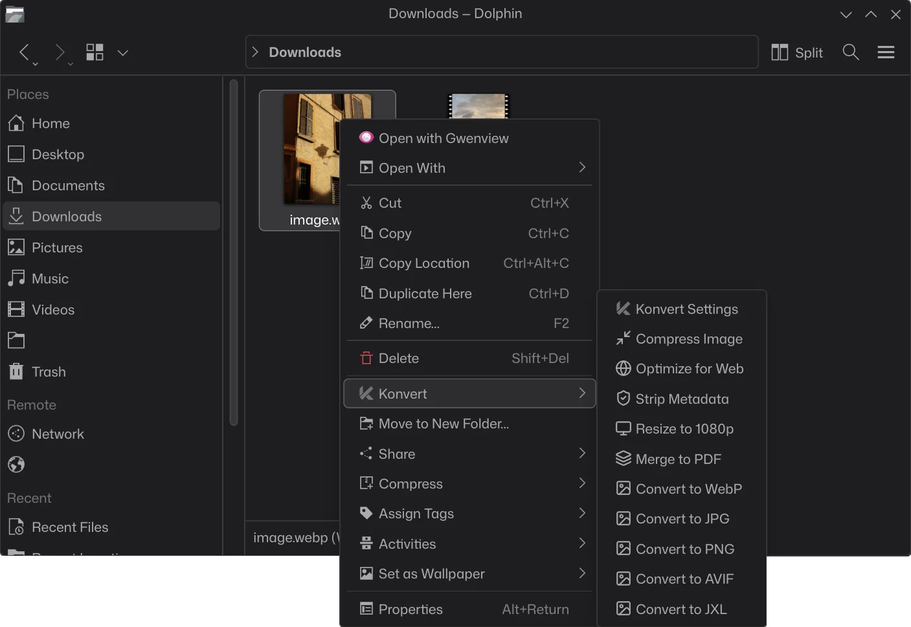
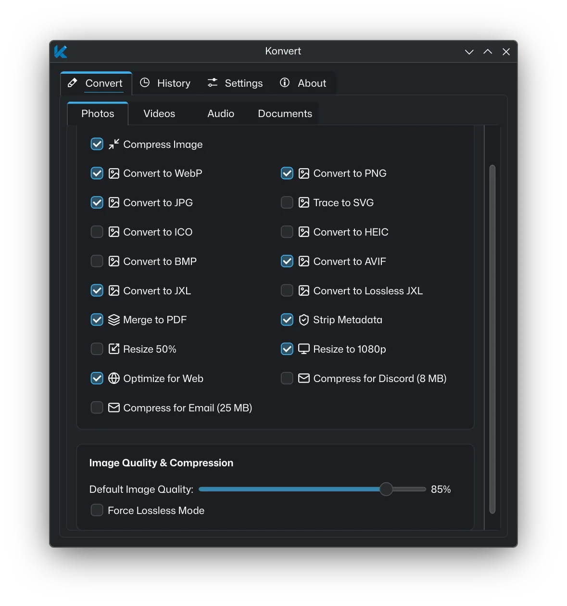
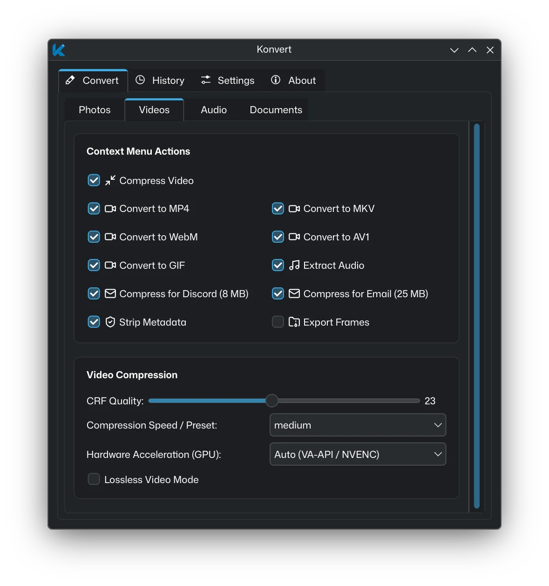
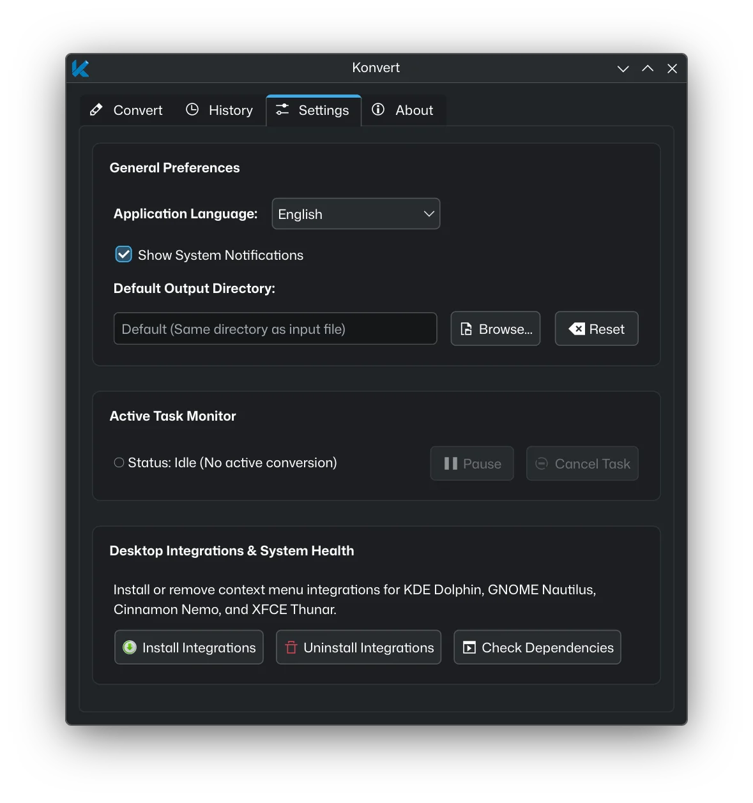
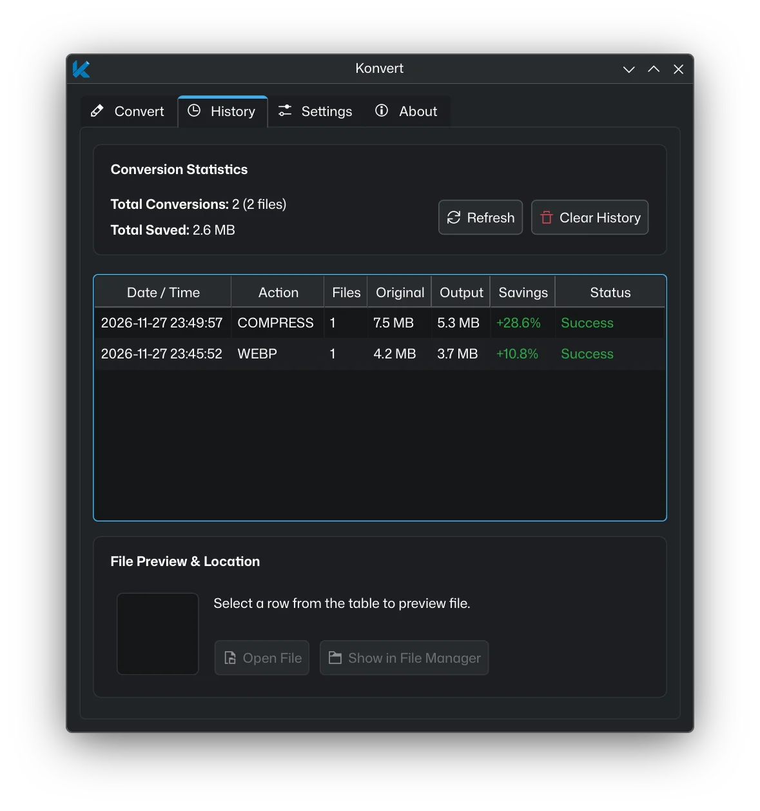
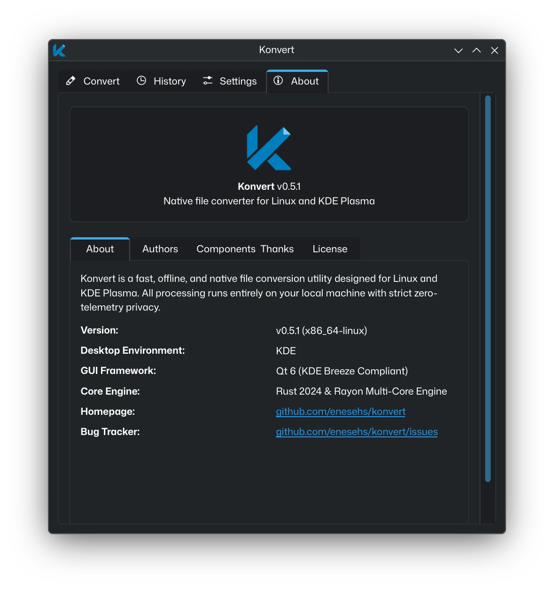
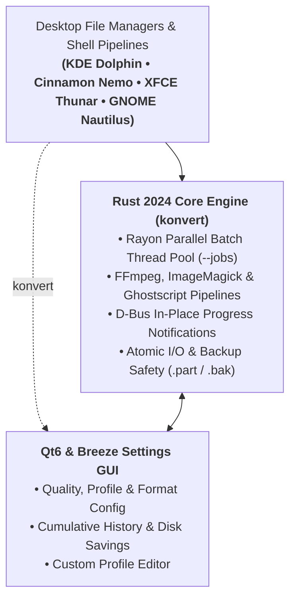

<div align="center">

  <a href="https://enesehs.dev/konvert">
    
  </a>

  <h1>Konvert</h1>

  <p>
    <b>A fast, offline, right-click file converter and optimizer for Linux.</b><br>
    Works in Dolphin, Nemo, Thunar and Nautilus, and from the terminal.
  </p>

  <a href="https://enesehs.dev/konvert">
    
  </a>

  <br><br>

  [](https://github.com/enesehs/konvert/actions/workflows/build.yml)
  [](https://github.com/enesehs/konvert/releases)
  [](https://aur.archlinux.org/packages/konvert-bin)
  [](https://www.gnu.org/licenses/gpl-3.0.html)

  <br>

  **English** • [Türkçe](README_tr.md)

  <p align="center">
    <a href="#quick-start">Quick Start</a> •
    <a href="#why-konvert">Why Konvert?</a> •
    <a href="#benchmarks">Benchmarks</a> •
    <a href="#screenshots">Screenshots</a> •
    <a href="#features">Features</a> •
    <a href="#installation">Installation</a> •
    <a href="#cli-usage">CLI Usage</a> •
    <a href="#supported-formats">Formats</a> •
    <a href="#architecture">Architecture</a> •
    <a href="#security">Security</a>
  </p>

</div>

---

## Quick Start

Get up and running in seconds:

```bash
# 1. Install via universal script
curl -sSL https://enesehs.dev/konvert/install.sh | bash

# Or install from AUR (Arch Linux)
yay -S konvert-bin

# 2. Convert or optimize any file instantly (CLI or right-click in file manager)
konvert -t webp photo.png

# 3. Open the native Qt6 & Breeze settings panel
konvert
```

---

## Why Konvert?

Tired of uploading private files to online converter sites, switching to browser tabs, or waiting for bloated Electron apps?

*  **Zero Telemetry & 100% Privacy:** Every single byte stays on your local hardware; conversions run 100% offline with zero telemetry (network access occurs only if you explicitly run `--check-update`).
*  **Native Right-Click Menus:** Instant right-click integration for **KDE Dolphin**, **Cinnamon Nemo**, **XFCE Thunar**, and **GNOME Nautilus**.
*  **Rust 2024 & Rayon Parallelism:** Multi-threaded parallel batch execution with zero GC pauses and ~25 MB base RSS footprint.
*  **Mathematical Target Sizing:** Compress videos and images to strict limits (Discord 8 MB, Email 25 MB) with automated ladder search.
*  **Live In-Place Plasma Notifications:** Dynamic animated progress bars and live ETA updates in your desktop notification center.
*  **Audit History & Savings:** Track cumulative disk space savings, preview 80×80 thumbnails, and reveal files in one click.

 *Explore full interactive comparison and feature deep-dives at [enesehs.dev/konvert](https://enesehs.dev/konvert).*

---

## Benchmarks

Measured on AMD Ryzen 7 7800X3D (8 cores / 16 threads) with [`scripts/benchmark.py`](scripts/benchmark.py).

### Batch Processing & Speedup (12.7 MB 4K `3840x2160` PNG)

| Operation | Mode | Output Size | Disk Saved | Bare Tool (Single) | Konvert (Single) | Konvert (Rayon `-j 8` ×50) |
|---|---|---|---|---|---|---|
| **JPEG XL (`.jxl`)** | `--lossless` | 12.4 MB | **2.4%** | 1.02 s (`cjxl`) | 1.02 s | **43.89 s** (~1.2× vs serial `cjxl`) |
| **WebP (`.webp`)** | `-q 85` | 849.2 KB | **93.5%** | 604 ms (`magick`) | 600 ms | **4.62 s** (~6.5× vs serial `magick`) |
| **JPEG (`.jpg`)** | `-q 90` | 2.2 MB | **82.3%** | 194 ms (`magick`) | **187 ms** (`image-rs`) | **1.52 s** (~6.2× vs serial) |
| **Unix Pipe (`-`)** | Stdin -> Stdout (1080p) | Stream | — | — | **152 ms** latency | — |

- **Zero Wrapper Overhead:** JPEG encoding runs in-memory via Rust's `image-rs` (`JpegEncoder`). WebP, JXL, video, and documents invoke native tools directly (`magick`, `cjxl`, `ffmpeg`) without shell overhead. Across 50 files, Rayon (`-j 8`) delivers ~6.2–6.5× throughput on single-threaded encoders (`cjxl` already parallelizes internally).
- **Low Footprint:** ~24–28 MB base RSS for the Rust core (zero Electron/JVM). Peak memory during 4K video transcoding or heavy PDF jobs is governed by FFmpeg and Ghostscript subprocesses.

### Quality & Fidelity (1080p Reference Media)

#### Image Quality

| Format / Profile | Output Size | Disk Saved | Latency | PSNR (dB) | SSIM |
|---|---|---|---|---|---|
| **WebP (`-q 85`)** | 70.6 KB | **97.3%** | 128.8 ms | 37.67 dB | **0.9985** |
| **JPEG XL (`.jxl`)** | 72.7 KB | **97.3%** | 140.8 ms | 40.14 dB | **0.9984** |
| **AVIF (`-q 80`)** | 35.4 KB | **98.7%** | 1106.6 ms | 42.31 dB | **0.9983** |
| **JPEG (`-q 90`)** | 212.2 KB | **92.0%** | 54.9 ms | 42.67 dB | **0.9989** |
| **WebP (`--lossless`)** | 820.5 KB | **69.1%** | 49.7 ms | 61.59 dB | **1.0000** |

#### Video, Audio & Document Fidelity

| Target / Preset | Reference | Output Size | Disk Saved | Quality Metric |
|---|---|---|---|---|
| **Discord 8MB Profile** | 1080p MP4 (20.6 MB) | 6.98 MB | **66.1%** | **40.05 dB PSNR** / **0.9906 SSIM** |
| **MP3 (320 kbps)** | 48 kHz WAV (375 KB) | 158.5 KB | **57.7%** | **74.18 dB SNR** |
| **MP3 (192 kbps)** | 48 kHz WAV (375 KB) | 95.1 KB | **74.6%** | **30.46 dB SNR** |
| **FLAC Audio** | 48 kHz WAV (375 KB) | 97.2 KB | **74.1%** | **Lossless (Exact Match)** |
| **DOCX -> TXT** | `source_doc.docx` | 682 B | — | **100% Word & Character Recall** |
| **UDF (UYAP) -> TXT** | `source_court.udf` | 519 B | — | **100% Word & Character Recall** |

*Reproduce throughput measurements locally anytime with `python3 scripts/benchmark.py`.*

---

## Screenshots

<div align="center">
  <sub><b>Desktop Right-Click Context Menu Integration</b></sub><br>
  <a href="assets/screenshots/screenshot_context_menu_compressed.webp">
    
  </a>
</div>

<br>

<table align="center" width="100%">
  <tr>
    <td width="33.3%" align="center" valign="top">
      <sub><b>Image Conversion & Profiles</b></sub><br>
      <a href="assets/screenshots/screenshot_conver_image_compressed.webp">
        
      </a>
    </td>
    <td width="33.3%" align="center" valign="top">
      <sub><b>Video Conversion & Presets</b></sub><br>
      <a href="assets/screenshots/screenshot_convert_video_compressed.webp">
        
      </a>
    </td>
    <td width="33.3%" align="center" valign="top">
      <sub><b>Qt6 & Breeze Settings</b></sub><br>
      <a href="assets/screenshots/screenshot_settings_compressed.webp">
        
      </a>
    </td>
  </tr>
</table>

<table align="center" width="100%">
  <tr>
    <td width="50%" align="center" valign="top">
      <sub><b>Conversion History & Disk Savings</b></sub><br>
      <a href="assets/screenshots/screenshot_history_compressed.webp">
        
      </a>
    </td>
    <td width="50%" align="center" valign="top">
      <sub><b>KDE Developer About Dialog</b></sub><br>
      <a href="assets/screenshots/screenshot_about_compressed.webp">
        
      </a>
    </td>
  </tr>
</table>

---

## Features

| Feature | Description |
|---|---|
|  **Multi-Desktop Integration** | Separated context actions for Photos, Videos, Audio, and Documents without MIME-type pollution across Dolphin, Nemo, Thunar, and Nautilus. |
|  **Rust 2024 Rayon Engine** | Multi-threaded parallel batch execution with configurable thread budgets (`--jobs`), zero GC pauses, and LTO-optimized release binaries. |
|  **Preset Profiles** | Built-in presets (`web`, `balanced`, `archive`, `lossless`) plus custom profile creation (`--save-profile <name>`) saved in `config.toml`. |
|  **Unix Pipeline (`-`)** | Direct stdin/stdout streaming with automatic magic-byte format identification for shell pipelines. |
|  **Atomic Data Safety** | All file writes use temporary `.part` files with atomic commits, collision avoidance (`_2`, `_3`), and optional `.bak` backups (`--backup`). |
|  **Next-Gen Image Formats** | Native support for JPEG XL (`.jxl`), AVIF, QOI, WebP, HEIC, ICO, BMP, TIFF, GIF, and raster-to-SVG contour tracing via `potrace` (with automatic bitmap embed fallback). |
|  **Document & PDF Tools** | Direct UDF (UYAP) and DOCX to PDF/TXT conversions with structural table and header extraction, plus multi-image PDF merge. |
|  **Multi-Language (i18n)** | CLI, `--doctor`, and core engine errors localized in 9 languages (`--lang <code>`: EN, TR, DE, FR, ES, IT, RU, ZH, JA); Qt6 Settings GUI localized in 5 languages with a 9-language selector. |

---

## Installation

### Method 1: Universal One-Line Installer (Recommended)

Installs the precompiled release binary, icons, shell completions, and file manager service menus:

```bash
curl -sSL https://enesehs.dev/konvert/install.sh | bash
```

> [!TIP]
> **Audit before running:** You can inspect the installer source at [`docs/public/install.sh`](docs/public/install.sh) or verify its checksum:
> ```bash
> curl -sSL https://enesehs.dev/konvert/install.sh -o /tmp/install.sh
> curl -sSL https://enesehs.dev/konvert/install.sh.sha256 -o /tmp/install.sh.sha256
> (cd /tmp && sha256sum -c install.sh.sha256)
> bash /tmp/install.sh
> ```

### Method 2: Debian / Ubuntu (.deb Package)

Download the `.deb` release package from [GitHub Releases](https://github.com/enesehs/konvert/releases) or build it locally:

```bash
# Install downloaded package:
sudo dpkg -i konvert_*.deb
sudo apt-get install -f

# Or build from repository:
./packaging/build-deb.sh
```

### Method 3: Arch Linux / AUR

```bash
# Prebuilt binary (fastest)
yay -S konvert-bin

# Or build from source
yay -S konvert

# (paru works the same way: paru -S konvert-bin)

# Or build locally from PKGBUILD:
cd packaging
makepkg -si
```

### Method 4: Portable AppImage

Download the latest `.AppImage` from the [Releases page](https://github.com/enesehs/konvert/releases/latest), then make it executable and run it:

```bash
chmod +x Konvert-*.AppImage
./Konvert-*.AppImage

# Or build the AppImage yourself:
./packaging/build-appimage.sh
```

### Method 5: Flatpak (Flathub Manifest)

```bash
flatpak-builder --user --install --force-clean build-dir packaging/io.github.enesehs.konvert.json
```

### Method 6: Local Build from Source

```bash
git clone https://github.com/enesehs/konvert.git
cd konvert
./scripts/install.sh
```

---

## CLI Usage

Konvert provides a clean, predictable CLI interface with full flag validation:

```bash
# ── Preset Profiles & Pipeline ─────────────────────────────────────────
konvert --profile web -t webp photo.png       # Apply web profile (80% quality, 150 DPI)
konvert --profile archive -t jpg photo.png     # Apply archive profile (95% quality, 600 DPI)
konvert --profile lossless -t webp photo.png  # Lossless encoding mode
konvert --list-profiles                       # List available built-in and user profiles
cat photo.png | konvert -t webp - > out.webp  # Stream conversion via stdin/stdout pipe

# ── Smart Target Size Compression ──────────────────────────────────────
konvert -t discord_8mb video.mp4              # Compress video mathematically to fit 8 MB
konvert -t email_25mb video.mp4               # Compress video to fit 25 MB
konvert --target-size 15MB video.mp4          # Custom target size constraint

# ── Image Conversion & Optimization ────────────────────────────────────
konvert -t webp -q 90 photo.png                # WebP with explicit quality setting
konvert -t jxl --lossless photo.png            # Lossless JPEG XL conversion
konvert -t avif photo.png                      # AVIF next-generation conversion
konvert -t svg photo.png                       # Vectorize raster image to SVG contours
konvert -t resize_50 photo.png                 # Downscale resolution by 50%
konvert -t resize_1080p photo.jpg              # Fit within Full HD (1920x1080) bounds
konvert -t strip-metadata photo.jpg            # Strip EXIF, GPS, and sensor metadata

# ── Document & PDF Tools ───────────────────────────────────────────────
konvert --merge-pdf p1.png p2.jpg p3.webp     # Merge multiple images into a single PDF
konvert -t pdf document.udf                    # Convert UDF document directly to PDF
konvert -t txt document.docx                   # Extract formatted text and tables from DOCX

# ── Video & Audio Utilities ────────────────────────────────────────────
konvert -t gif video.mp4                       # High-quality two-pass palette GIF
konvert -t extract-audio video.mp4             # Extract audio stream as MP3
konvert --extract-frames video.mp4             # Extract video frames into folder as PNGs
konvert -t audio-to-video song.mp3             # Generate waveform MP4 video from audio

# ── Batch Processing, Diagnostics & Live Job Control ──────────────────
konvert -t webp -j 4 *.png                    # Parallel batch conversion with 4 CPU threads
konvert -t mp4 --hwaccel auto video.mkv        # GPU hardware acceleration (VA-API / NVENC)
konvert -r -t webp ./photos                    # Recursively scan and convert directories
konvert --dry-run -t webp *.jpg                # Preview output paths and collision plan
konvert --backup -f -t png photo.jpg           # Overwrite safely with automatic .bak backup
konvert --doctor                               # Verify toolchains, GPU encoders, and environment
konvert --check-update                         # Check GitHub releases for software updates
konvert --pause                                # Pause ongoing background conversion
konvert --resume                               # Resume paused background conversion
konvert --cancel                               # Safely cancel ongoing background conversion
konvert                                        # Open Qt6 Settings GUI
```

---

## Supported Formats

| Category | Input Formats | Target Formats | Engine Capabilities |
|---|---|---|---|
|  **Photos** | PNG, JPG, JPEG, WebP, AVIF, JXL, SVG, BMP, ICO, TIFF, QOI, HEIC, HEIF, GIF | WebP, PNG, JPG, SVG, ICO, HEIC, BMP, AVIF, JXL, TIFF, QOI | EXIF Auto-Orientation, EXIF Stripping, 50% & 1080p Resizing, Multi-Image PDF Merge, Potrace SVG Vector Tracing |
|  **Videos** | MP4, MKV, WebM, AVI, MOV, FLV, TS, WMV, M4V | MP4, MKV, WebM, AV1, GIF | Discord 8 MB, Email 25 MB, Custom Target Sizing, Lossless Metadata Stripping, Frame & Audio Extraction, Two-Pass GIF |
|  **Audio** | MP3, WAV, FLAC, OGG, Opus, AAC, M4A, WMA, AIFF | MP3, WAV, FLAC, OGG, Opus, AAC, M4A | Configurable Bitrates (`128k` to `320k`), Lossless Metadata Stripping, Waveform Video (MP4) Generation |
|  **Documents** | UDF (UYAP), DOCX, PDF | PDF, PNG, JPG, TXT, HTML | Multi-DPI Page Rendering (36-1200 DPI), Ghostscript Optimization, DOCX/UDF Table, Text & HTML Extraction |

---

## Architecture


```mermaid
flowchart TD
    FM["Desktop File Managers & Shell Pipelines<br><b>(KDE Dolphin • Cinnamon Nemo • XFCE Thunar • GNOME Nautilus)</b>"] --> CORE["<b>Rust 2024 Core Engine (konvert)</b><br>• Rayon Parallel Batch Thread Pool (--jobs)<br>• FFmpeg, ImageMagick & Ghostscript Pipelines<br>• D-Bus In-Place Progress Notifications<br>• Atomic I/O & Backup Safety (.part / .bak)"]
    FM -.->|"konvert"| GUI["<b>Qt6 & Breeze Settings GUI</b><br>• Quality, Profile & Format Config<br>• Cumulative History & Disk Savings<br>• Custom Profile Editor"]
    CORE <--> GUI
```

---

## Security

Konvert is engineered around a zero-telemetry, 100% offline security posture. Because conversions delegate to system-level external tools for specific formats, users and system administrators should be aware of the following security considerations:

* **External Engine Delegates:** Complex document and vector conversions delegate to system binaries (`ghostscript` for PostScript/PDF rasterization, `imagemagick` for format negotiation, and `libreoffice` for DOCX/UDF rendering). When processing untrusted files from external sources, system administrators should ensure security patches are applied and ImageMagick security policies (`/etc/ImageMagick-7/policy.xml`) restrict vulnerable legacy coders.
* **Input Sanitization & Injection Prevention:** Konvert does not execute commands through a shell interpreter (`sh -c`). All external processes are invoked via direct POSIX `exec` arrays with strictly validated file paths, preventing command injection vulnerabilities.
* **Denial of Service (DoS) Guards:** XML document extraction (UDF, DOCX) enforces a strict 50 MB decompression limit to prevent zip-bomb attacks.
* **System Diagnostics:** Run `konvert --doctor` at any time to verify the status, path, and version of all external delegate binaries.

---

## Known Issues

- **Debian Qt6 ABI Mismatch (`Qt_6.10` vs `Qt 6.8`):** On Debian (including Debian 13 Trixie, where the latest packaged Qt is `6.8`), binaries compiled against `Qt 6.10` fail to open `konvert-settings` with a missing `Qt_6.10` version symbol error. *(Workaround: build locally via `./scripts/install.sh` or use a release built on Ubuntu 24.04.)*
- **GNOME Files (Nautilus) Context Menu Hierarchy:** Right-click script grouping and submenu hierarchy in GNOME Files (Nautilus) is not yet structured as intended and is queued for redesign.

---

## Roadmap

### v0.5.2 (Hardening & Bug Fixes)
- [ ] Fix simulated progress (`15 + 6t`) in `src/dispatcher.rs` to use indeterminate/estimated reporting and deduplicate the single/merge `recv_timeout` loop.
- [ ] Complete i18n coverage for remaining hardcoded strings (`dispatcher.rs`, `doctor.rs`, `main.rs`, `converter/mod.rs`) and unify Rust (`src/i18n.rs`) + Qt6 (`gui/src/translator.h`) translation tables to a single source.
- [ ] Move `FORCE_OVERWRITE` and `CREATE_BACKUP` global atomics into `ConvertOptions` to eliminate global state and `GLOBAL_FLAG_TEST_LOCK`.
- [ ] Fix GNOME Files (Nautilus) right-click context menu hierarchy and script grouping.
- [ ] Unify `scripts/` (`install.sh`, `uninstall.sh`) and `docs/public/` copies under a single source of truth with CI sync validation.
- [ ] Add real E2E video/audio transcode tests and fuzz/edge-case tests for magic-byte and XML parsers.
- [ ] Modularize large source files (`gui/src/mainwindow.cpp`, `converter/mod.rs`, `video.rs`, `dispatcher.rs`) and standardize code comments in English.

### v0.6.0 (Features)
- [ ] Image rotation and transform actions (`rotate` 90°/180°/270°, `flip`) in CLI and context menus.
- [ ] Hierarchical right-click submenus (`Convert`, `Compress`, `Transform`, `Extract`) for Dolphin, Nemo, Thunar, and Nautilus.
- [ ] First-launch missing desktop integration detection in Qt6 GUI with one-click `--install-all` setup.
- [ ] PDF page split/reorder tools and optional watch-folder background auto-conversion mode.

---

## Contributing

Contributions are welcome and appreciated! Please read [`CONTRIBUTING.md`](CONTRIBUTING.md) and [`todo.md`](todo.md) before submitting changes.

### Contribution Rules

- **Error Handling & Safety:** No `.unwrap()` or `.expect()` in production Rust code; no `sh -c` shell execution (use direct `Command` arg arrays); keep all file writes atomic (`.part` / `.bak`).
- **Offline Guarantee:** Zero telemetry; conversions must stay 100% offline.
- **Quality Gates:** All PRs must pass formatting, lints, and tests with zero warnings:
  - `cargo fmt -- --check`
  - `cargo clippy --all-targets -- -D warnings`
  - `cargo test`
  - Qt6 GUI changes must also build cleanly via `cmake -B gui/build -S gui -DCMAKE_BUILD_TYPE=Release && cmake --build gui/build`.

### Workflow

1. Fork the repository.
2. Create your feature branch (`git checkout -b feat/amazing-feature`).
3. Commit your changes using Conventional Commits (`git commit -m 'feat: add amazing feature'`).
4. Run the checks above and ensure everything passes.
5. Push to your branch (`git push origin feat/amazing-feature`) and open a **Pull Request**.

---

## License

This project is licensed under the **GNU General Public License v3.0 or later (GPL-3.0-or-later)**. See the [LICENSE](LICENSE) file for details.

---

<div align="center">
  <b>Developer:</b> <a href="https://github.com/enesehs">enesehs</a> &bull;
  <b>Website:</b> <a href="https://enesehs.dev">https://enesehs.dev</a><br>
  <sub>Crafted with dedication for Linux and the Open Source Community.</sub>
</div>
